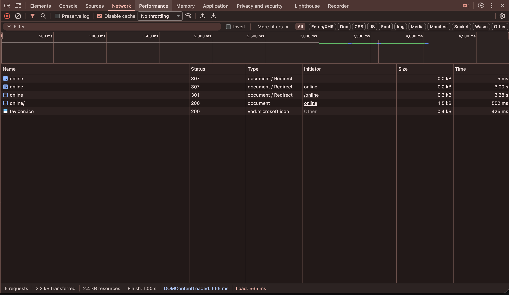

Browser DevTools Analysis
1. HTTP vs HTTPS Comparison

Websites tested:

    http://neverssl.com (HTTP)
    https://github.com (HTTPS)
    https://youtube.com (HTTPS)

Screenshots:

- 
- 

*Wireshark*
-> Wireshark is a network protocol analyzer, a tool that lets you capture, inspect and analyze data that travels through websites
**Observations**

HTTP (http://neverssl.com)
- It add data in plain text

HTTPS(https://github.com & https://youtube.com)
- It transfers data but with an additional security layer (TLS-Transport Layer Security) which encrypts the data between your browser and website

**Why HTTPS is more secure:**
HTTPS uses TLS encryption, which ensures data is unreadable to attackers, verifies the website’s identity (via certificates), and prevents tampering.

Which made the most requests and why?
YouTube made the most requests because it loads multiple scripts, ads, thumbnails, and video-related assets dynamically.

Timing Phases (example from GitHub main request):

*DNS Lookup*: Time to resolve github.com to IP
*Connection Time*: Time to open TCP + TLS handshake
*Waiting (TTFB)*: Time until first byte from server (server processing)

Insight:
The more resources (scripts, images) a site loads, the more requests and latency it introduces.