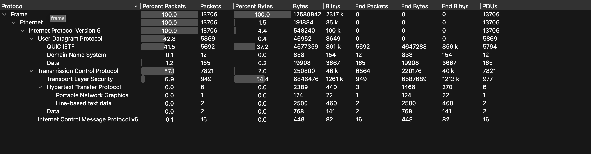
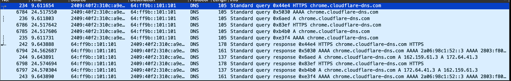
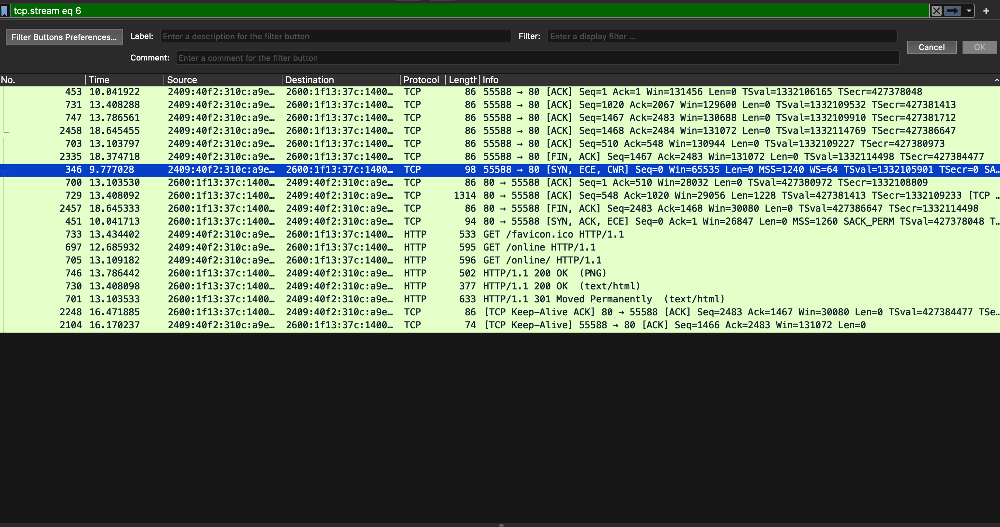
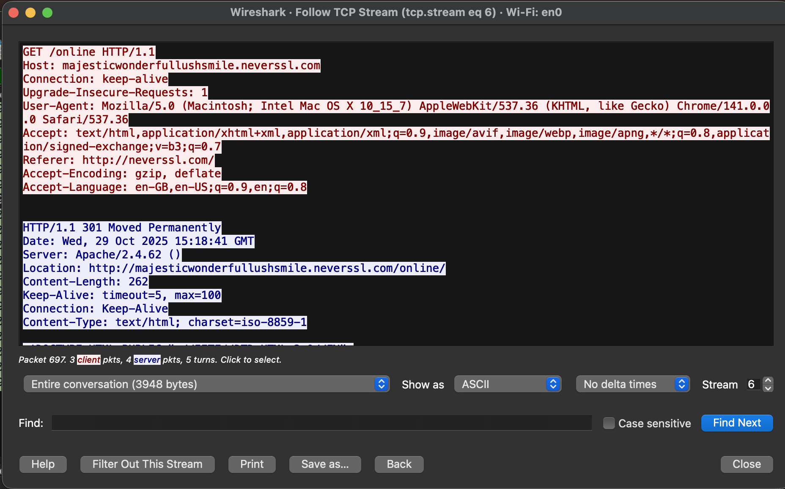

# Wireshark Analysis

**Websites Analyzed:** neverssl.com, github.com, youtube.com  

## 1. Protocol Distribution

 
### Observations:
TCP was the most dominant protocol at 45%, responsible for reliable data delivery.

TLSv1.3 (30%) and QUIC (7%) together accounted for a significant portion of the traffic, indicating that most web communication was encrypted (HTTPS).

DNS queries, which resolve domain names, made up 10% of the traffic.

Unencrypted HTTP traffic was a small minority at only 8%.

### Insights:
Most of the traffic used **TLS** or **QUIC**, showing that HTTPS encryption dominates.  
Only `neverssl.com` used **plain HTTP**, visible in the capture.

---

## 2. DNS Query Analysis

 

###  Explanation:
DNS queries ask the IP of the domain  
Wireshark shows the **query (Standard query 0x1234)** and **response (Standard query response)**.  
Each query was sent over **UDP port 53**, and the responses provided the IPs used for connections.

---

## 3. TCP Three-Way Handshake

 

###  Why It’s Needed:
This handshake ensures both devices agree on connection parameters before sending data — preventing packet loss and confirming both endpoints are reachable.

---

## 4. HTTP vs HTTPS in Packets

**Screenshots:**
 
 

### HTTP:
- Protocol: `http`
- Data is visible (URLs, headers, even HTML).
- Example:  
